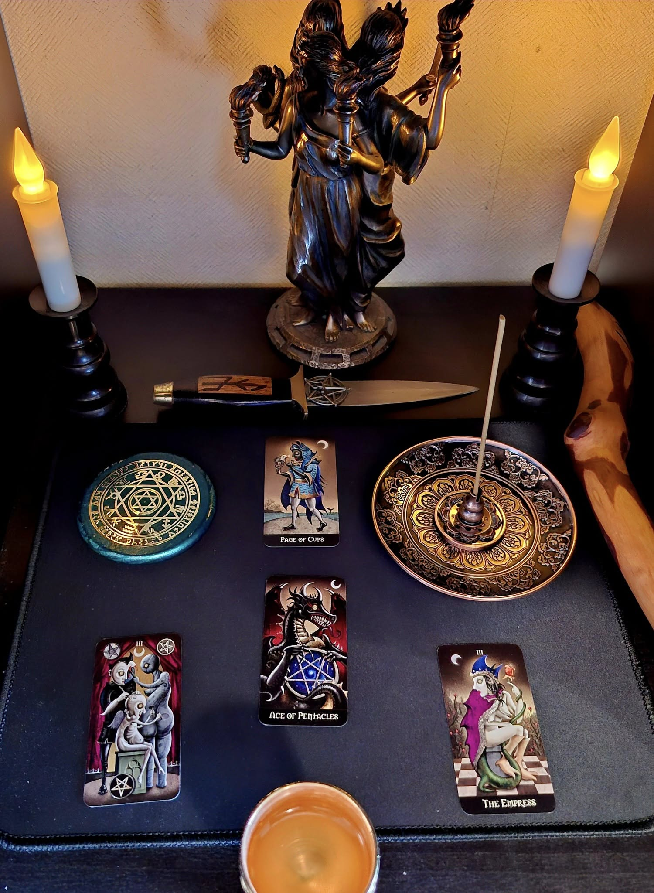
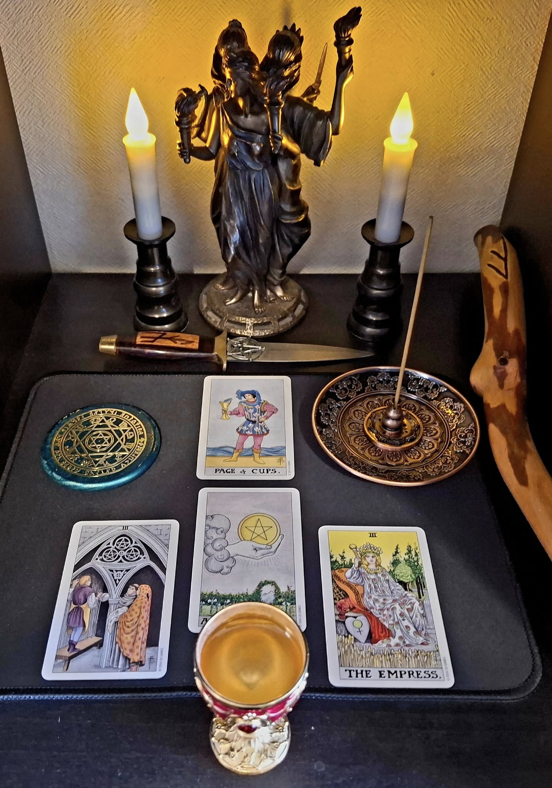

# 本棚神殿での金運上昇の儀式

## ✨ 概要

本プロトコルは、未来の約束された財富との縁を組み、その源を呼び込むための「本棚神殿」を使った簡易な金運上昇の儀式です。

## 🌌 時期

- 木曜日、または木星の時間
- 月の満ちていく期間

## 📝 用意するもの

- 本棚神殿
- 小さめのタロットデッキ (Deviant Moon Tarot や Universal Tarot など)
- 電池式ろうそくやお香など

## 💫 カードの配置（技の三角スプレッド形式）

本プロトコルは、チック・シセロおよびサンドラ・タバサ・シセロの『タロット・タリスマン』に記されている「技の三角スプレッド」の構成に準じています。

| カード | 意味 | 代表カード（Deviant Moon Tarot） |
|--------|------|-------------------------------|
| 1 | 対象者（自分自身） | カップのペイジ |
| 2 | 初動 | 女帝 |
| 3 | 進行 | ペンタクルの3 |
| 4 | 結果 | ペンタクルのエース |

## 🌟 儀式の流れ

1. 本棚神殿の電池式ろうそくを点け、お香を炊く
3. 上記の4枚を、技の三角スプレッドの形に配置する
5. 金運の祈りを唱える
6. 数日間そのまま本棚神殿に祈りの報告として置いておく

## 🗺️ カード配置レイアウト

この儀式で使用するカードの配置は以下の通りです：

## 💡 コツ

> 本棚神殿のスペースは限られているので、小さめのタロットデッキが理想的です。カードを重ねてもOKです。「三角スプレッド」の形を別の場所で置いてそれを覚えてから、最終的に4枚を一つに重ねて、神殿の中央に重ねて置いても大丈夫。大切なのは、型式の完璧さよりも「願いとカードのがつながっている」感覚です。

## 🕯️ 英語による祈り（ヘカテへの金運祈願）

**Invocation to Hekate for Prosperity**  
*(Based on the Four Cards in the Golden Dawn Triad Spread)*

> O Hekate, Torchbearer of the Crossroads,
> Guardian of Seen and Unseen—
> I stand before Your shrine with an open heart,
> Clear in my intent: not for greed, but for flow.
>
> （交差点の光を持つヘカテよ、
> 顕れたものと隠されたものの守り手よ——
> 私は開かれた心であなたの神殿の前に立ちます。
> 願いは貪欲のためでなく、流れのために。）
>
> Let the Page of Cups awaken inspiration,
> That my path may begin in truth and hope.
>
>（カップのペイジが霊感を目覚めさせ、
> 私の道が真実と希望のうちに始まりますように。）
>
> As the Empress nurtures, may my work be blessed.
> As the Three of Pentacles shows, let effort bear fruit.
> May it rise like the Ace—abundance made real.
>
> （女帝が育むように、私の努力も祝福されますように。
> ペンタクルの3が示すように、努力が実を結びますように。
> そしてそれがペンタクルのエースのように現実となりますように。）
>
> Guide my wealth in peace and justice.
> So mote it be.
>
> （私の富を平和と正義のうちに導いてください。
> そのようになりますように。）

## 🖼️ 写真による実例

### 使用例：Deviant Moon Tarot

### 参考例：Universal Tarot

## 📚 参考文献

本儀式は、チック・シセロおよびサンドラ・タバサ・シセロ『タロット・タリスマン』に基づいていますが、Ravensgateの実践に合わせ、本棚神殿での実行に適した形で再構成しています。

---

🌀本プロトコルは「Open Source Witchcraft」プロジェクトの一環として公開されています。  
誰でも実践可能で、改変・共有自由な魔術プロトコルです。

---

## 💡 備考

- このプロトコルは「日本語話者のための実用的な呪術形式」として開発中です  
- 本プロトコルは **クリエイティブ・コモンズ (CC BY-NC-SA)** で提供予定

---

## 🚧 バージョンとライセンス

© 2025 知られざる呪術師（Le Sorcier Inconnu）  
本ドキュメントは [Creative Commons BY-SA 4.0](https://creativecommons.org/licenses/by-sa/4.0/deed.ja) に基づき公開されています。
