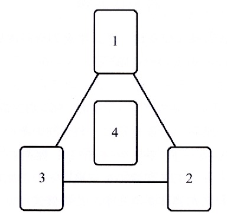

# 本棚神殿での金運上昇の儀式_v01

## ✨ 概要

本プロトコルは、未来の約束された財富との縁を組み、その源を呼び込むための「本棚神殿」を使った簡易な金運上昇の儀式です。

## 🌌 時期

- 木曜日、または木星の時間
- 月の満ちていく期間

## 📝 用意するもの

- 本棚神殿
- 小さめのタロットデッキ (Deviant Moon Tarot や Universal Tarot など)
- 電池式ろうそくやお香など

## 💫 カードの配置（技の三角スプレッド形式）

本プロトコルは、チック・シセロおよびサンドラ・タバサ・シセロの『タロット・タリスマン』に記されている「技の三角スプレッド」の構成に準じています。

| カード | 意味 | 代表カード（Deviant Moon Tarot） |
|--------|------|-------------------------------|
| 1 | 対象者（自分自身） | カップのペイジ |
| 2 | 初動 | 女帝 |
| 3 | 進行 | ペンタクルの3 |
| 4 | 結果 | ペンタクルのエース |

## 🌟 儀式の流れ

1. 本棚神殿の電池式ろうそくを点け、お香を炊く
3. 上記の4枚を、技の三角スプレッドの形に配置する
5. 金運の祈りを唱える
6. 数日間そのまま本棚神殿に祈りの報告として置いておく

## 🗺️ カード配置レイアウト

この儀式で使用するカードの配置は以下の通りです：

## 💡 コツ

> 本棚神殿のスペースは限られているので、小さめのタロットデッキが理想的です。カードを重ねてもOKです。「三角スプレッド」の形を別の場所で置いてそれを覚えてから、最終的に4枚を一つに重ねて、神殿の中央に重ねて置いても大丈夫。大切なのは、型式の完璧さよりも「願いとカードのがつながっている」感覚です。

## 🕯️ 英語による祈り（ヘカテへの金運祈願）

**Invocation to Hekate for Prosperity**  
*(Based on the Four Cards in the Golden Dawn Triad Spread)*

> O Hekate, Torchbearer of the Crossroads,  
> Guardian of the Threshold between Seen and Unseen—  
> I stand before Your shrine in humility and trust,  
> With heart open like the Page of Cups.  
> （おお三叉の女神ヘカテよ、交差点に火を掲げる者よ、  
> 顕れたものと隠されたものの間に立つ門の守り手よ——  
> 私は謙虚と信頼をもってあなたの神殿の前に立ちます。  
> そしてカップのペイジのように、心を開いて。）

> I offer my intent, clear and true:  
> Not for greed, but for sufficiency,  
> Not for hoarding, but for flow.  
> May my desire align with Your will.  
> （私の願いは明確で真実です：  
> 貪欲のためではなく、満ち足りるために、  
> 蓄えるためではなく、流れるために。  
> どうか私の願いが、あなたの御意と調和しますように。）

> As the Empress nurtures the garden of life,  
> So may You nurture my efforts.  
> May the seeds I plant in thought and deed  
> Find root in the fertile soil of Your blessing.  
> （女帝が生命の園を育むように、  
> あなたが私の努力を育んでくださいますように。  
> 思考と行動により私が植えた種が、  
> あなたの祝福という豊かな土壌に根を下ろしますように。）

> As the Three of Pentacles teaches,  
> Let my work be skilled, my hands steady,  
> Let collaboration and structure lead to growth,  
> And effort unfold in harmony.  
> （ペンタクルの3が教えるように、  
> 私の仕事が熟練し、手が安定していますように。  
> 協力と構造が成長を導き、  
> 努力が調和の中で展開しますように。）

> Let it culminate in the Ace of Pentacles—  
> A gift from the unseen into the seen,  
> A tangible sign of abundance.  
> May it be the first of many, and never the last.  
> （それがペンタクルのエースとなって結実しますように——  
> 見えざるものから現れた贈り物、  
> 豊かさの具体的なしるし。  
> それが最初の一つであり、決して最後になりませんように。）

> O Hekate, Key-Bearer and Light in Darkness,  
> Bless this rite, receive this offering,  
> And let Your wisdom guide my wealth  
> To come in peace, and flow in justice.  
> So mote it be.  
> （おおヘカテよ、鍵を持ち、闇に光を灯す者よ、  
> この儀式を祝福し、この捧げものを受け入れてください。  
> あなたの叡智が私の富を導きますように——  
> 平和のうちに訪れ、正義のうちに流れますように。  
> そのようになりますように。）

## 🖼️ 写真による実例

### 使用例：Deviant Moon Tarot

### 参考例：Universal Tarot

## 📚 参考文献

本儀式は、チック・シセロおよびサンドラ・タバサ・シセロ『タロット・タリスマン』に基づいていますが、Ravensgateの実践に合わせ、本棚神殿での実行に適した形で再構成しています。

---

🌀本プロトコルは「Open Source Witchcraft」プロジェクトの一環として公開されています。  
誰でも実践可能で、改変・共有自由な魔術プロトコルです。

---

## 💡 備考

- このプロトコルは「日本語話者のための実用的な呪術形式」として開発中です  
- 本プロトコルは **クリエイティブ・コモンズ (CC BY-NC-SA)** で提供予定

---

## 🚧 バージョンとライセンス

- Version: 0.1 (試作)  
- License: CC BY-NC-SA (表示-非営利-継承)

---
